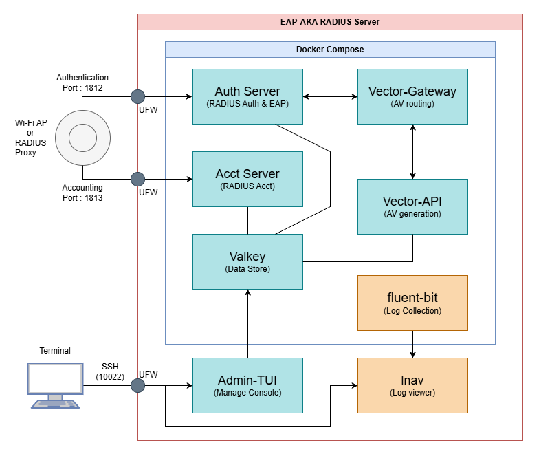

# eapaka-radius-server-poc

[](https://go.dev/)
[](LICENSE)

## 概要

EAP-AKA/AKA' RADIUS サーバーの PoC (Proof of Concept) 環境です。
Wi-Fi 認証 (WPA2/WPA3-Enterprise) 向けの RADIUS 認証・課金機能、AKA 認証ベクター生成機能、および管理用 TUI アプリケーションを提供します。

## アーキテクチャ



> 図には接続方式01の aka-only-server（外部・任意）は含まれていません。

| コンポーネント | 役割 | ポート |
|---|---|---|
| **auth-server** | RADIUS 認証 + EAP-AKA/AKA' ステートマシン制御 | UDP 1812 |
| **acct-server** | RADIUS 課金 (Accounting) | UDP 1813 |
| **vector-gateway** | 認証ベクター生成リクエストのルーティング（PLMN 単位で接続方式 00: vector-api / 01: aka-only-server に振り分け） | HTTP 8080（コンテナ内のみ） |
| **vector-api** | Milenage アルゴリズム計算 + SQN 管理 | HTTP 8080（コンテナ内のみ） |
| **admin-tui** | 加入者・セッション管理用ターミナル UI | - |
| **provisioning-api**（任意） | 加入者・RADIUSクライアント・認可ポリシーの REST API（`/admin/v1`）。本PoCの外の BFF から mTLS で操作する。compose の profile `provisioning` で起動 | HTTPS 9444（既定 127.0.0.1 のみ） |
| **valkey** | データストア (加入者情報・セッション等) | 6379（127.0.0.1 のみ） |
| **fluent-bit** | ログ収集・転送 | 24224（127.0.0.1 のみ） |
| **aka-only-server**（外部・任意） | 接続方式01。指定 PLMN の AKA 認証ベクターを払い出す外部サーバー（3GPP TS 29.503 Nudm_UEAU GenerateAv ベース、[aka-only-server](https://github.com/oyaguma3/aka-only-server)）。mTLS で接続 | HTTPS 8443（平文 HTTP 8080） |

## 技術スタック

- **言語:** Go 1.25.5
- **データストア:** Valkey 9.0
- **コンテナ:** Docker Compose
- **ログ収集:** Fluent Bit 4.2
- **ロギング:** log/slog (構造化ログ)
- **RADIUS:** [layeh.com/radius](https://pkg.go.dev/layeh.com/radius)
- **EAP-AKA:** [go-eapaka](https://github.com/oyaguma3/go-eapaka)
- **Circuit Breaker:** sony/gobreaker

## リポジトリ構成

```
eapaka-radius-server-poc/
├── apps/
│   ├── auth-server/        # RADIUS 認証サーバー
│   ├── acct-server/        # RADIUS 課金サーバー
│   ├── vector-gateway/     # ベクター生成ルーティング
│   ├── vector-api/         # Milenage 計算 + SQN 管理
│   ├── provisioning-api/   # マスタデータの REST API（任意）
│   └── admin-tui/          # 管理用 TUI アプリケーション
├── pkg/                    # 共通ライブラリ
│   ├── apperr/             # エラー定義
│   ├── httputil/           # HTTP ユーティリティ
│   ├── logging/            # ログ設定
│   ├── model/              # 共通モデル
│   ├── validation/         # マスタデータの入力検証（Admin TUI / Provisioning API 共通）
│   ├── masterdata/         # マスタデータの Valkey アクセス（同上）
│   └── valkey/             # Valkey クライアント
├── configs/
│   └── fluent-bit/         # Fluent Bit 設定 (YAML)
├── deployments/
│   ├── docker-compose.yml  # Docker Compose 定義
│   ├── docker-compose.aka-av.yml  # aka-only-server 共有ネットワーク用オーバーレイ
│   ├── .env.example        # 環境変数テンプレート
│   ├── certs/              # aka-only-server 接続用証明書の配置先（中身は .gitignore 対象）
│   └── lnav_formats/       # lnav ログフォーマット定義
├── docs/                   # 設計・運用ドキュメント (27ファイル)
├── go.work                 # Go Workspace 定義
└── go.work.sum
```

## セットアップ

### 前提条件

- Docker & Docker Compose
- Go 1.25.5 (ローカル開発時)

### 起動手順

```bash
# リポジトリをクローン
git clone https://github.com/oyaguma3/eapaka-radius-server-poc.git
cd eapaka-radius-server-poc

# 環境変数を設定
cd deployments
cp .env.example .env
# .env を編集して各値を設定

# Docker Compose を起動
docker compose up -d
```

本番相当の環境へのデプロイ手順は、ミニPC（LAN 内）なら B-01 / B-02、VPS（AWS Lightsail 等。インターネットに公開）なら B-03 を参照してください。インターネットに公開する場合は、`RADIUS_SECRET` を空のままにし、クラウド側のファイアウォールで RADIUS（1812/1813/udp）の送信元を AP のIPに限ってください。

### 主要な環境変数

| 変数名 | 必須 | 説明 |
|---|---|---|
| `VALKEY_PASSWORD` | Yes | Valkey 接続パスワード |
| `RADIUS_SECRET` | No | フォールバックの RADIUS 共有シークレット。設定すると、クライアント登録（送信元IP）のない送信元からのパケットもこの値で受け付ける。インターネットに公開する場合は空のままにする |
| `VECTOR_GATEWAY_MODE` | No | 動作モード (`gateway` / `passthrough`) |
| `VECTOR_GATEWAY_PLMN_MAP` | No | PLMN と接続方式 ID の対応 (例: `44010:01`。未一致 PLMN は `00` = 内部 vector-api) |
| `VECTOR_GATEWAY_INTERNAL_TIMEOUT` | No | 内部 vector-api 呼び出しタイムアウト (デフォルト: `3s`。auth-server のタイムアウト 5 秒より短くすること) |
| `VECTOR_GATEWAY_AKAONLY_URL` | No | aka-only-server のベース URL (空なら接続方式01は無効。`https://` で mTLS、`http://` で平文) |
| `VECTOR_GATEWAY_AKAONLY_CLIENT_CERT` / `_CLIENT_KEY` | No | aka-only-server 用クライアント証明書・秘密鍵 (例: `/certs/av-client.pem`。鍵は省略時 CLIENT_CERT から読む) |
| `VECTOR_GATEWAY_AKAONLY_SERVER_CERT` | No | aka-only-server の AV 用サーバー証明書 (例: `/certs/av-server.pem`) |
| `VECTOR_GATEWAY_AKAONLY_TIMEOUT` | No | aka-only-server 呼び出しタイムアウト (デフォルト: `3s`。auth-server のタイムアウト 5 秒より短くすること) |
| `LOG_MASK_IMSI` | No | IMSI マスキング有効化 (デフォルト: `true`) |
| `LOG_LEVEL` | No | ログレベル (`DEBUG` / `INFO` / `WARN` / `ERROR`、デフォルト: `INFO`。対象: auth-server / acct-server / vector-gateway / vector-api / provisioning-api) |
| `TEST_VECTOR_ENABLED` | No | テストベクターモード (デフォルト: `false`、本番では無効のこと) |
| `PROVISIONING_API_ADMIN_CLIENTS` | No | Provisioning API の管理クライアント（`識別名=クライアント証明書のSHA-256フィンガープリント` のカンマ区切り。provisioning-api を使う場合は必須） |
| `PROVISIONING_API_BIND` | No | Provisioning API の 9444/tcp を公開するアドレス (デフォルト: `127.0.0.1`) |
| `PROVISIONING_API_NODE_NAME` | No | Provisioning API の `/status` が返すノード名 |

詳細は `deployments/.env.example` を参照してください。

### aka-only-server への接続（任意）

接続方式01を使う場合は、aka-only-server でクライアント証明書の発行・登録と加入者登録を行い、証明書を `deployments/certs/` に置いて `.env` を設定します。同一ホストの場合は aka-only-server を先に起動し、オーバーレイを重ねて起動します。

```bash
docker compose -f docker-compose.yml -f docker-compose.aka-av.yml up -d
```

手順の詳細は B-02 アプリケーションデプロイ手順書 §14 を参照してください。

### Provisioning API（任意）

本PoCの外の BFF から加入者・RADIUSクライアント・認可ポリシーを操作する場合は、サーバー証明書を `deployments/certs/provisioning/`（`server.pem` / `server.key`）に置き、BFF のクライアント証明書のフィンガープリントを `.env` の `PROVISIONING_API_ADMIN_CLIENTS` に登録して、profile を指定して起動します。

```bash
docker compose --profile provisioning up -d
```

API 仕様は `docs/openapi/provisioning-api.yaml`、設計は D-13、手順の詳細は B-02 §15 を参照してください。

## テスト実行

```bash
# Go Workspace ルートから全モジュールのテストを実行
go test ./...

# カバレッジ付きで実行
go test -cover ./...

# 特定のアプリケーションのみ
go test ./apps/auth-server/...
```

テスト規模: 126 テストファイル、1,461 テストケース (T-02 単体テスト仕様書準拠)

## 実装状況

全コンポーネントの実装が完了しています。

| コンポーネント | ステータス |
|---|---|
| auth-server | 完了 |
| acct-server | 完了 |
| vector-gateway | 完了 |
| vector-api | 完了 |
| admin-tui | 完了 |
| provisioning-api | 完了 |
| インフラ (Docker Compose / Fluent Bit / Valkey) | 完了 |

## ドキュメント

`docs/` 配下に各種設計・運用ドキュメントがあります（全29件作成済み）。

### 設計ドキュメント (13件)

| No. | ドキュメント名 | 内容 |
|---|---|---|
| D-01 | 設計仕様書 | 全体アーキテクチャ・リポジトリ構成 |
| D-02 | Valkey データ設計仕様書 | データストア設計・キー設計 |
| D-03 | Vector-API IF 定義書 | API インターフェース・EAP-AKA ステートマシン |
| D-04 | ログ仕様設計書 | ログフォーマット・event_id 定義 |
| D-05 | Admin TUI 詳細設計書【前半】 | 画面設計・バリデーション |
| D-06 | エラーハンドリング詳細設計書 | 異常系処理・Circuit Breaker |
| D-07 | Admin TUI 詳細設計書【後半】 | モニタリング画面・ヘルプ |
| D-08 | インフラ設定・運用設計書 | Docker Compose・Valkey・Fluent Bit 設定 |
| D-09 | Auth Server 詳細設計書 | 認証サーバー詳細設計 |
| D-10 | Acct Server 詳細設計書 | 課金サーバー詳細設計 |
| D-11 | Vector API 詳細設計書 | Milenage 計算・SQN 管理 |
| D-12 | Vector Gateway 詳細設計書 | PLMN ルーティング・外部 API 連携 |
| D-13 | Provisioning API 詳細設計書 | マスタデータの REST API・mTLS・監査ログ |

### 開発ドキュメント (3件)

| No. | ドキュメント名 | 内容 |
|---|---|---|
| E-01 | 開発環境セットアップガイド | Go 環境構築・ローカル開発手順 |
| E-02 | コーディング規約（簡易版） | 命名規則・パッケージ構成 |
| E-03 | 共通ライブラリ(pkg)設計書 | pkg 配置方針・各パッケージ設計 |

### テストドキュメント (4件)

| No. | ドキュメント名 | 内容 |
|---|---|---|
| T-01 | テスト戦略書 | テスト方針・カバレッジ目標 |
| T-02 | 単体テスト仕様書 | 全 1,461 テストケース定義 |
| T-03 | 結合テスト仕様書 | コンポーネント間連携テスト |
| T-04 | E2E テスト仕様書 | 実機テスト・擬似 E2E (計 11 シナリオ) |

### 構築・デプロイドキュメント (3件)

| No. | ドキュメント名 | 内容 |
|---|---|---|
| B-01 | ホストOS構築手順書 | Ubuntu Server インストール・セキュリティ設定 |
| B-02 | アプリケーションデプロイ手順書 | Docker Compose 起動・logrotate・バックアップ |
| B-03 | VPSデプロイ手順書（AWS Lightsail） | VPS への構築・デプロイ（ファイアウォール、SSH、RADIUS の公開範囲） |

### 運用ドキュメント (5件)

| No. | ドキュメント名 | 内容 |
|---|---|---|
| O-01 | 操作ガイド | 加入者登録・ポリシー設定・セッション監視の操作手順 |
| O-02 | ポリシー設定ガイド | NAS-ID/SSID 設定例・VLAN 割り当て例 |
| O-03 | 障害対応手順書 | 障害検知・切り分け・復旧手順・エスカレーション |
| O-04 | バックアップ・リストア手順書 | Valkey データのバックアップ/リストア・設定ファイル管理 |
| O-05 | ログ解析ガイド | lnav の使い方・頻出クエリ集・障害調査パターン |

### 補足資料 (1件)

| No. | ドキュメント名 | 内容 |
|---|---|---|
| S-01 | eapaka_test 利用ノウハウ | eapaka_test の設定・テストケース解説・トラブルシューティング |

詳細は [ドキュメント一覧](docs/EAP-AKA_RADIUS_PoC環境_ドキュメント一覧_r58.md) を参照してください。

## ライセンス

[MIT License](LICENSE)
